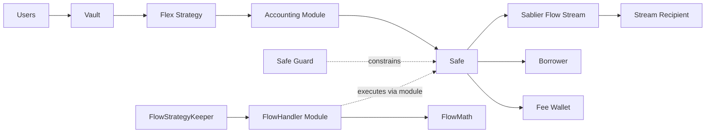
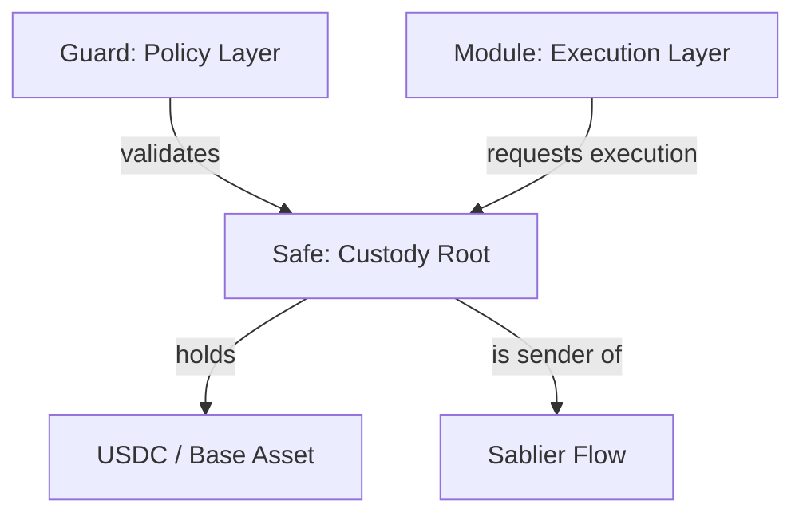
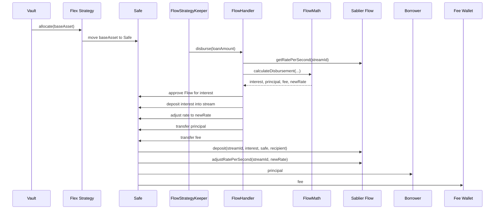
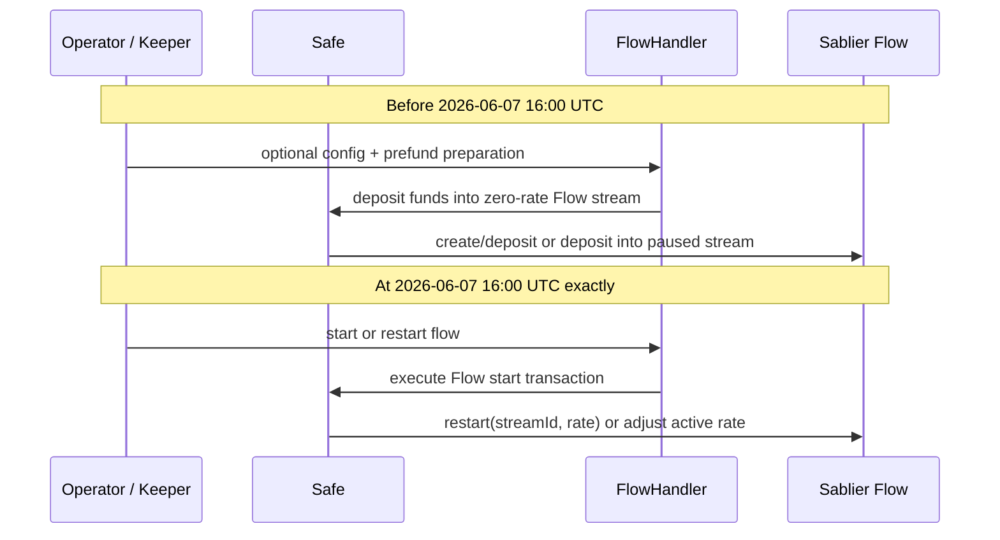
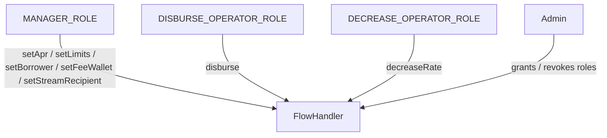
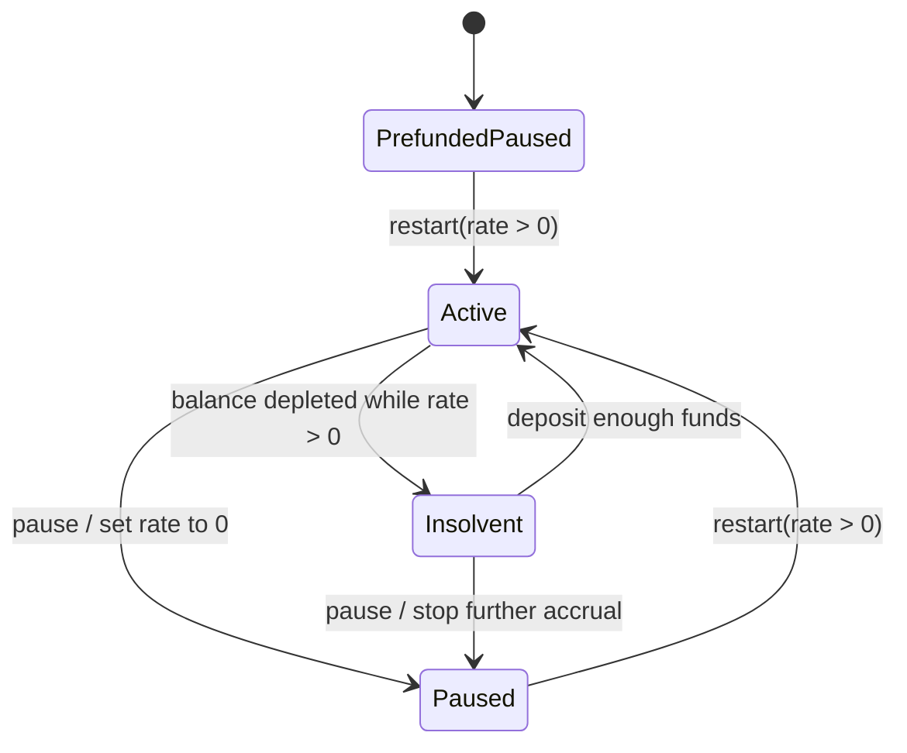

# RWA Flow Architecture

This document explains how the YieldNest RWA flow components fit together on-chain, how custody and control are separated, and how the system transitions from the final existing Sablier stream into the Sablier Flow stream.

Important transition point:

- The last existing Sablier stream ends at `2026-06-07 16:00 UTC` (`Jun 07 '26, 4PM GMT`).
- At that exact moment, the Sablier Flow stream needs to start emitting.

## High-Level Model

- The Vault holds user-facing accounting and share logic.
- The Flex strategy allocates base asset to a Safe.
- The Safe is the custody container for assets.
- The Safe Guard constrains what the Safe can execute.
- Safe modules implement bounded operational logic.
- `FlowHandler` is the module that manages the Sablier Flow stream.
- `FlowStrategyKeeper` decides when to process new inflows and calls `FlowHandler`.
- `FlowMath` computes disbursement and stream-rate changes deterministically.



## Custody And Control Separation

The core operating principle is:

- assets sit in the `Safe`
- policy sits in the `Guard`
- execution sits in modules

That means:

- `FlowHandler` does not custody funds itself
- `FlowHandler` can only move funds by making the Safe execute allowed actions
- the Guard can enforce allowed targets, selectors, stream IDs, recipients, and rate bounds



## Inflow And Disbursement Lifecycle

When new capital is ready to be processed:

1. `FlowStrategyKeeper` checks whether processing should occur.
2. Funds are allocated from the Vault to the Flex strategy.
3. The Flex strategy routes base asset into the Safe.
4. The keeper calls `FlowHandler.disburse(loanAmount)`.
5. `FlowHandler` reads current stream state.
6. `FlowMath` computes the full disbursement result in one pure step.
7. `FlowHandler` has the Safe:
   - approve Flow for the interest amount
   - deposit interest into the stream
   - adjust the stream rate upward
   - transfer principal to the borrower
   - transfer fee to the fee wallet



## Sablier Transition On 2026-06-07 16:00 UTC

The final existing Sablier stream ends at:

- `2026-06-07 16:00 UTC`

At that exact timestamp, the Flow stream should begin emitting.

There are two valid operational patterns:

1. Pre-create the Flow stream at zero rate, prefund it, then `restart(...)` at `2026-06-07 16:00 UTC`.
2. Create and fund the Flow stream with a non-zero rate at `2026-06-07 16:00 UTC`.

The first pattern is operationally cleaner because the stream object already exists before the cutover, and the cutover transaction only has to start the rate.

```mermaid
timeline
    title Stream Transition Timeline
    2026-06-07 16:00 UTC : Final existing Sablier stream ends
                         : Sablier Flow stream must start
```



## What Must Be True At Handoff

At `2026-06-07 16:00 UTC`, the following should already be true:

- the Safe is funded with enough base asset to support the first Flow period
- the Flow stream exists, or the creation transaction is prepared
- the Flow stream recipient is correct
- the stream ID configured in `FlowHandler` is correct
- the Guard allows the exact Flow operations needed for handoff
- operator or keeper permissions are already granted

## Roles

Current role split in `FlowHandler`:

- `DISBURSE_OPERATOR_ROLE`
  - may call `disburse`
- `DECREASE_OPERATOR_ROLE`
  - may call `decreaseRate`
- `MANAGER_ROLE`
  - may update config such as APR, holding period, borrower, fee wallet, stream recipient, and limits



## Safety Boundaries

This architecture is strongest when:

- accounting correctness remains outside `FlowHandler`
- `FlowHandler` is only an execution adapter plus bounded policy storage
- `FlowMath` stays pure and deterministic
- the Guard remains simple and focuses on hard outer constraints

The main invariant is not that the system is fully trustless. The main invariant is:

- operators can only perform a bounded set of actions with Safe-held funds

## Failure Handling

If the Flow stream is underfunded:

- the rate may remain non-zero
- uncovered debt accumulates while the stream is insolvent
- once new funds are deposited, those funds first cover accrued debt

If the Flow stream is paused:

- the rate is `0`
- no additional streaming debt accumulates
- funds can sit prefunded until the stream is restarted



## Recommended Operating Pattern For The Jun 07 2026 Cutover

Recommended approach:

1. Pre-create the Flow stream before `2026-06-07 16:00 UTC`.
2. Keep it at zero rate.
3. Prefund it ahead of time.
4. At `2026-06-07 16:00 UTC`, start it with `restart(streamId, rate)`.

Why this is preferable:

- the stream ID is already known
- custody setup is already tested
- the only critical cutover action is rate activation
- if funds are deposited while the rate is zero, nothing is consumed before the handoff

## Summary

The RWA design works by combining:

- Vault/accounting logic outside the Safe control plane
- Safe-based custody
- Guard-based policy enforcement
- module-based execution
- Sablier Flow for continuous yield distribution

For the final transition:

- the legacy stream ends at `2026-06-07 16:00 UTC`
- the Flow stream should start at that same timestamp
- the safest operational path is to prefund a zero-rate Flow stream and `restart(...)` it at the cutover moment
